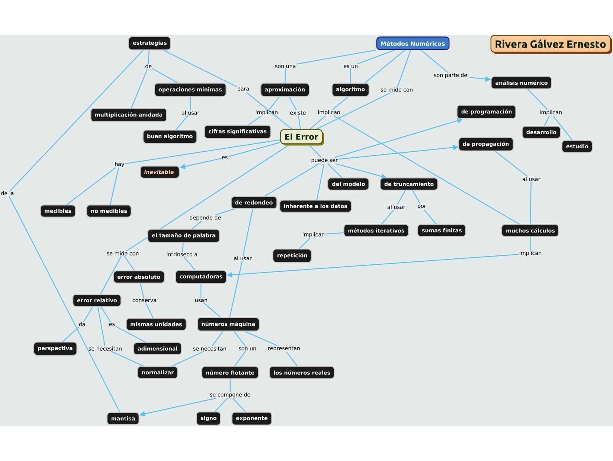

## [Regresar al ínidce](https://github.com/neto-riga/Metodos_Numericos/blob/main/Portafolio.md#índice)

# Ejercicio 0. Mapa conceptual. Error en los métodos numéricos

En este ejercicio se muestra un mapa conceptual que intenta abarcar todos los temas vistos en la unidad 1. Esto es, el error en los métodos numéricos.

## [Regresar al ínidce](https://github.com/neto-riga/Metodos_Numericos/blob/main/Portafolio.md#índice)